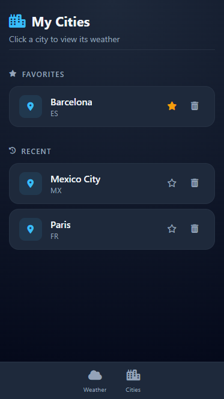

# Weather App

Weather application that shows current conditions, hourly forecasts, and 5-day outlooks for any city in the world. Built with vanilla JavaScript and Vite, powered by the OpenWeatherMap API.

**[Live Demo](https://weatherappfrontendunison.netlify.app)**

## Screenshots

Desktop


Mobile




## Features

- Search any city worldwide with autocomplete suggestions
- Hourly forecast for the rest of the day
- 5-day weather outlook
- Travel recommendations based on current conditions
- Save and manage favorite cities

## Requirements
- Node.js
- npm

## Setup
1. Install dependencies:
```bash
npm install
```
2. Create a .env file in the root of the project:
```bash
VITE_OPENWEATHER_API_KEY=your_api_key_here
```
3. Start the development server
```bash
npm run dev
```
